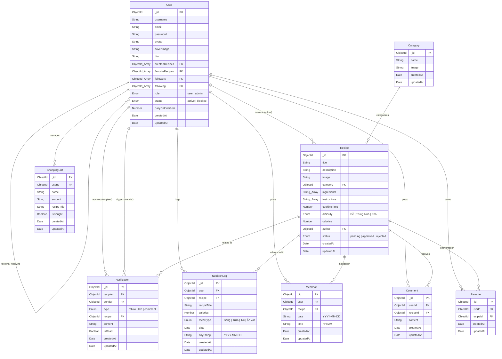

# Sơ đồ Database (ERD) - Sweet Recipes App

Tài liệu chi tiết CSDL MongoDB cho dự án Sweet Recipes.

## Sơ đồ ERD

---

## Danh sách các Collections

1. **User**: Quản lý thông tin người dùng, vai trò, trạng thái, danh sách làm theo/theo dõi, danh sách món đã tạo & yêu thích.
2. **Recipe**: Lưu thông tin công thức làm bánh ngọt, nguyên liệu, quy trình, độ khó, calo, tác giả và trạng thái phê duyệt.
3. **Category**: Danh mục loại món ăn (Ví dụ: Bánh ngọt, Chè, Đồ uống,...).
4. **Favorite**: Bảng liên kết lưu danh sách các công thức yêu thích của từng người dùng.
5. **Comment**: Các bình luận của người dùng trên các bài đăng công thức.
6. **MealPlan**: Lịch trình bữa ăn đã lên kế hoạch theo ngày và giờ.
7. **NutritionLog**: Nhật ký nạp calo theo ngày (bữa sáng, trưa, tối, ăn vặt).
8. **ShoppingList**: Danh sách đồ cần mua khi đi chợ làm bánh.
9. **Notification**: Hệ thống thông báo khi có người theo dõi, tim bài hoặc bình luận.
