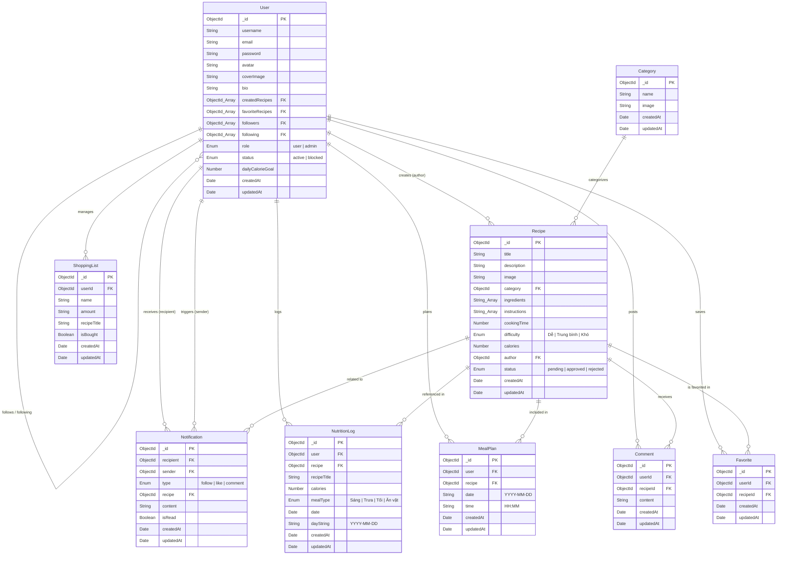

# Sweet Recipes App

Dự án ứng dụng công thức nấu ăn (Sweet Recipes).

## Hướng dẫn Cập nhật Code (DÀNH CHO THÀNH VIÊN NHÓM)

Do cấu trúc lịch sử Git của dự án vừa được tái cấu trúc và dọn dẹp lại cho gọn gàng, nên ở **LẦN CẬP NHẬT ĐẦU TIÊN NÀY**, các bạn **KHÔNG** dùng lệnh `git pull` bình thường (vì sẽ gây lỗi xung đột).

Hãy chọn **1 trong 2 cách sau** để đồng bộ code về máy của bạn:

### CÁCH 1: Xóa đi tải lại (Khuyên dùng - An toàn nhất)
Nếu bạn chưa code thêm tính năng gì mới trên máy cá nhân, hãy làm cách này để đảm bảo sạch sẽ 100%:
1. Xóa hẳn thư mục `sweet-recipes-app` hiện tại trên máy của bạn.
2. Mở Terminal và tải lại code mới: `git clone <link-github-cua-project>`
3. Mở thư mục mới tải, chạy `npm i` ở cả frontend và backend.

### CÁCH 2: Cập nhật trực tiếp bằng lệnh
Nếu bạn lười tải lại từ đầu, hãy mở Terminal trong thư mục project hiện tại và gõ đúng 2 lệnh sau:
```bash
git fetch origin
git reset --hard origin/main
```
*(Lưu ý: Lệnh này sẽ xóa bỏ các đoạn code bạn đang viết dở trên máy mà chưa push, để ép máy bạn giống hệt trên Github)*

> **Lưu ý cực kỳ quan trọng:**
> Hai cách trên chỉ cần làm **DUY NHẤT 1 LẦN NÀY THÔI**. 
> Kể từ những ngày sau trở đi, mọi người cứ gõ lệnh `git pull` bình thường như trước đây nhé!

---

## Hệ thống Tự động mồi dữ liệu (Auto Seeding)

Dự án đã được tích hợp hệ thống mồi dữ liệu thông minh. 

1. Chỉ cần gõ lệnh `npm run dev` ở thư mục backend.
2. Nếu Database MongoDB của bạn đang trống, hệ thống sẽ tự động lấy dữ liệu từ file `backend/src/data/seedData.json` (bao gồm tài khoản, công thức, bình luận, v.v.) và tự động bơm vào Database.
3. Không cần phải tự import data thủ công bằng tay nữa!

**Cách cập nhật dữ liệu mồi cho team (Dành cho người Test):**
Nếu bạn vừa tạo ra nhiều công thức mới trong quá trình test và muốn gửi dữ liệu đó cho cả team, hãy chạy lệnh sau ở thư mục `backend` **trước khi đẩy code lên Github**:
```bash
npm run export-db
```
Lệnh này sẽ lấy các công thức trong Database của bạn ghi đè vào file `seedData.json`. Sau đó bạn push lên Github. Thành viên khác pull code về, chạy `npm run dev` là sẽ thấy toàn bộ công thức mới của bạn.

---

## Sơ đồ Database (ERD)

Sơ đồ thể hiện các bảng (Collections), thuộc tính và mối quan hệ trong CSDL MongoDB của dự án Sweet Recipes (khi mở trên GitHub hoặc VS Code Preview sẽ tự động dựng hình vẽ):


